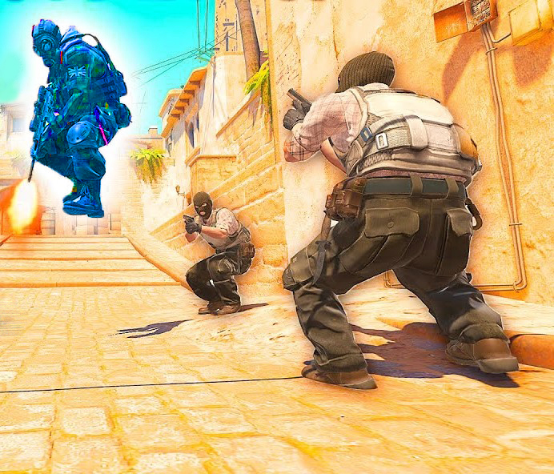
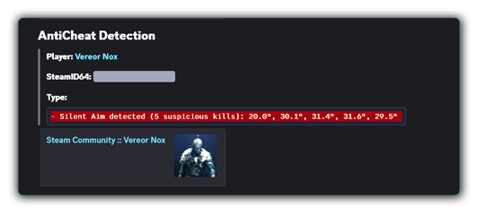

##  Discord Server

[](https://discord.gg/d5uvMmUpuE)

# CS2 Anticheat Defense

### CS2 AntiCheat Plugin based on CounterStrikeSharp helps prevent against cheaters.


Due to the presence of too many cheaters and too many spammers abusing your community server. We have created an Anti-Cheat Defense that is maximally optimized, but still effective against cheaters and spammers, which does not consume many resources like other ACs. It is quite effective in critical moments such as cheating, spamming and abuse. Easy and fully configurable, it also has integrated Discord notification with log

---

## 📚 Dependencies
[](https://www.sourcemm.net)

[](https://github.com/roflmuffin/CounterStrikeSharp)

**[CS2-SimpleAdmin](https://github.com/daffyyyy/CS2-SimpleAdmin)** (Optional)

---



---

## 📥 Installation

1. Download the latest `CS2-Anticheat-Defense.zip` from Author Discord
2. Extract contents to your `csgo/addons/counterstrikesharp/plugins` directory
3. Configure settings in `configs/plugins/ACD/ACD.json`
4. Restart your server!

---

> [!NOTE]
> ACD is useful and effective because it focuses on behavioral detection instead of only looking for known cheats or patterns.
> It’s not bypassed just because a cheat changes its code - it detects what the player is doing in-game, not just what software they run.           
>

## 🛡 AntiSpam (Included Modules)

- [x] **AntiChatAbuse**
- [x] **AntiRadioAbuse**
- [x] **AntiNickNameAbuse**


## 🛡 Detections

- [x]  **Aimbot**
- [x]  **Spinbot**
- [x]  **TriggerBot**
- [x]  **Rapid-Fire**
- [x]  **Bunnyhop**
- [ ]  **Wallhack** `(not fully supported, but included detections)`

## 📱 Discord Webhook
- You will receive notifications for every action from ACD

---

| ***Detection*** | ***Description*** | ***Values*** |
|----------|-------------|--------|
| **Spinbot** | `Our detection focuses on player movement patterns and view angle behavior` | `Threshold` |
| **Aimbot** | `Detects aimbots by monitoring unnatural aiming behavior and impossible reaction patterns.` | `Threshold` |
| **Triggerbot** | `Flags near-zero reaction times when shooting as soon as a target is in the crosshair.` | `Threshold` |
| **SilentAim** | `Detects silent aim by identifying shots that hit targets (catching cheats that manipulate aim angles to hide assistance).` | `Threshold` |
| **Wallhack** | `Detects blatant wallhacks by tracking actions.` | `Threshold` |
| **Bunnyhop** | `Detects perfectly timed consecutive jumps without human delay.` | `Threshold` |
| **Rapid Fire** | `Detects rapid-fire cheats by identifying weapon usage patterns that exceed normal human reaction times or game limitations.` | `Threshold` |

---

<details>
<summary><b>🛡 Detection Log</b> </summary>

</details>

## 🛒 [ Price ]
```diff
+ PRICE 10$ ( One Time Payment )
```

---

# 🔍 Contact Discord: **[CS2 DEV](https://discord.gg/d5uvMmUpuE)**

